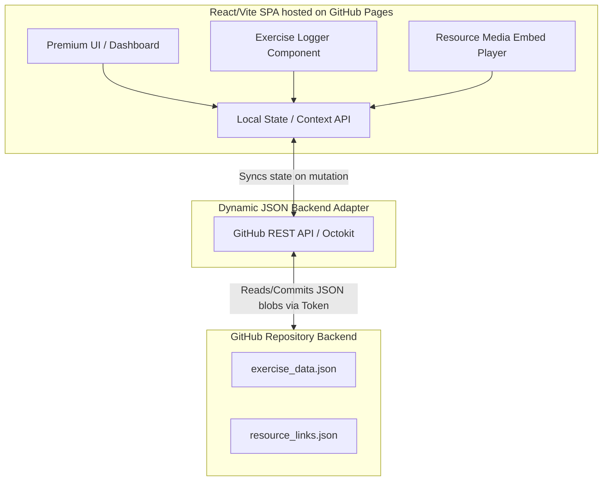

# ParentFit: Seamless Exercise Routine Logger & Resource Hub

This document outlines the end-to-end technical specification, system architecture, and UI/UX implementation plan to build **ParentFit**—a premium web application designed specifically for busy parents to effortlessly track their exercise routines and manage inspiring workout resources. 

The application will be hosted as a fully responsive Single Page Application (SPA) on **GitHub Pages**, utilizing a **Dynamic JSON Backend** stored within a GitHub repository. Persistence is achieved seamlessly via the GitHub REST API using the provided Personal Access Token (PAT).

---

## User Review Required

> [!IMPORTANT]
> **GitHub Token Security & Storage**
> The provided token (`ghp_` + `uv4StGEINUctZMW4TQfmmlK9eFg0T82FwEOI`) provides full/scoped write access to the GitHub account. Client-side storage of this token in public source code is insecure if the frontend repository is public. 
> **Proposed Solution**: We will implement an in-app **Settings/Configuration Panel** where the token is persisted securely in local browser storage (`localStorage`), encrypted/masked in the UI, and injected into REST API calls dynamically. Optionally, if the target repository for JSON hosting is private, the client-side approach remains fully secure for personal/family usage.

> [!TIP]
> **Rich Premium Aesthetics System**
> To ensure the app feels premium and delightful to encourage daily logging, we propose an elegant **Sleek Dark/Glassmorphism Theme** using deep curated hues (e.g., Deep Slate `#0f172a`, Vibrant Teal `#0ea5e9`, and Warm Coral `#f43f5e`), high-quality typography (Google Fonts: *Outfit* and *Inter*), and smooth micro-animations. Standard CSS modules/vanilla variables will be used to maintain full styling autonomy.

---

## Open Questions

> [!WARNING]
> **Target Repository Configuration**
> - Should the dynamic backend JSON files (`exercise_log.json` and `resource_links.json`) be written directly to the current repository (`Exercise Website`) or a dedicated isolated repository/Gist to prevent commit history bloating?
> - **Media Link Embedding**: For playing resource links seamlessly, should we default to a floating embedded multi-media player (supporting YouTube, Vimeo, and direct HTML5 audio/video files) or inline interactive cards?

---

## Architecture & Data Flow



### Data Schema Design

#### 1. `exercise_data.json`
Maintains an append-only/editable log of routines grouped chronologically.
```json
{
  "logs": [
    {
      "id": "log_1715712000",
      "date": "2026-05-14T08:30:00Z",
      "category": "Cardio / HIIT",
      "title": "Morning Stroller Jog & Core",
      "durationMinutes": 35,
      "intensity": "Moderate",
      "notes": "Felt great, baby slept through the second half.",
      "exercises": [
        { "name": "Jogging", "sets": 1, "repsOrDuration": "25 mins" },
        { "name": "Planks", "sets": 3, "repsOrDuration": "45 secs" }
      ]
    }
  ]
}
```

#### 2. `resource_links.json`
Stores curated, playable exercise references (videos, articles, routines).
```json
{
  "resources": [
    {
      "id": "res_101",
      "title": "15-Minute Postpartum Core Strength",
      "url": "https://www.youtube.com/watch?v=example",
      "type": "video",
      "addedAt": "2026-05-10T12:00:00Z",
      "tags": ["Core", "Quick", "Postpartum"]
    }
  ]
}
```

---

## Proposed Changes

We will bootstrap a modular, maintainable full-stack frontend layout optimized for AI Agents and Full Stack Developers to seamlessly build upon.

### Core Configuration & Dependencies

#### [NEW] `package.json`
- Initialize Vite with React (`create-vite-app`).
- Dependencies: `react`, `react-dom`, `@octokit/rest` (for GitHub API communication), `lucide-react` (for premium, modern icons).

#### [NEW] `vite.config.js`
- Standard Vite configuration optimized for local development and GitHub Pages static deployment output.

---

### UI Design System & Styling (Vanilla CSS)

#### [NEW] `src/index.css`
- Core CSS reset, design tokens (CSS variables for custom color palette, smooth gradients, glassmorphism borders/shadows), and baseline typography.
- Utility classes for flex/grid arrangements and micro-animations (pulse, slide-in, fade-in).

---

### Services / Backend Adapter Layer

#### [NEW] `src/services/githubBackend.js`
- Encapsulates Octokit calls using the GH token.
- Implements `fetchExerciseLogs()`, `saveExerciseLogs(data)`, `fetchResources()`, and `saveResources(data)`.
- Handles automatic SHA file retrieval necessary for updating existing files via the GitHub REST API.

---

### State Management & Context

#### [NEW] `src/context/AppContext.jsx`
- Unified React Context provider managing global application state: loaded logs, resource links, loading spinners, sync status, and active modal controls.
- Auto-triggers background synchronization when elements are added or deleted.

---

### Frontend Components

#### [NEW] `src/components/Navbar.jsx`
- Sleek sticky header showing app brand, online/sync status indicator, and quick action toggle for logging.

#### [NEW] `src/components/Dashboard.jsx`
- Main landing view showcasing dynamic statistics (e.g., Total Workouts this week, streaks), quick log actions, and recent activity timelines.

#### [NEW] `src/components/ExerciseLogger.jsx`
- Optimized form flow for busy parents. Features quick-select tags, smart defaults, and validation.

#### [NEW] `src/components/ResourceHub.jsx`
- Grid list displaying saved dynamic links. Includes a "+ Add Link" interactive trigger and one-click item removal tools.

#### [NEW] `src/components/MediaPlayerModal.jsx`
- Floating modal dialog capable of dynamically parsing and rendering embedded media (YouTube iframe embedding, HTML5 video/audio integration) directly inside the interface without context switching.

---

## Verification Plan

### Automated Tests & Validation
- **Static Compilation**: Verify the build pipeline functions properly via `npm run build` without missing imports or linting errors.
- **API Simulation**: Mock responses from GitHub API to test client-side resilience against network timeouts or empty states.

### Manual Verification Flow
1. **Initial Token Validation**: Enter/configure the GitHub token in the app settings, ensuring state initializes gracefully.
2. **Dynamic JSON Creation**: Add an exercise routine log via the UI. Verify that an API call successfully pushes the new state to `exercise_data.json` on GitHub.
3. **Resource Integration**: Paste a valid standard media URL into the resource adder. Confirm it appears instantly in the grid, saves to `resource_links.json`, and triggers the inline embedded player correctly upon clicking "Play".
4. **Responsive Experience Check**: Inspect UI elements across Desktop, Tablet, and Mobile viewport modes to guarantee flawless ergonomics for parents logging routines on their handheld devices.
